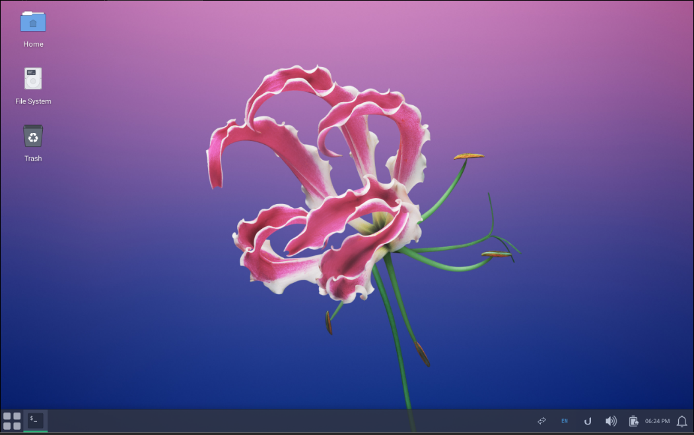
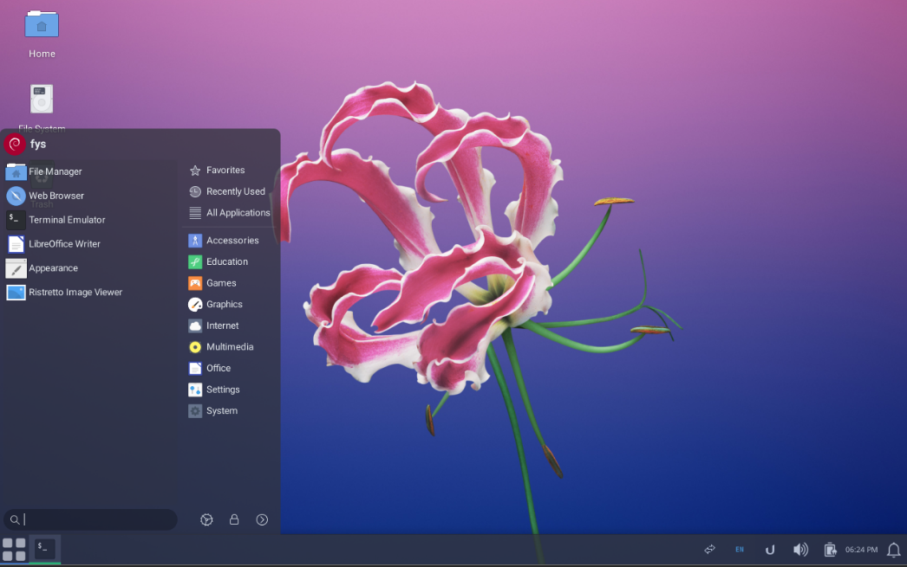
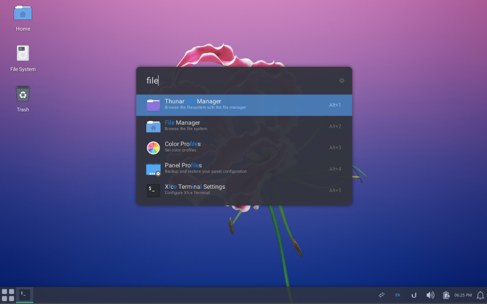
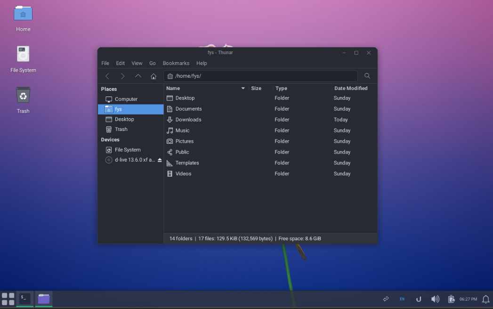
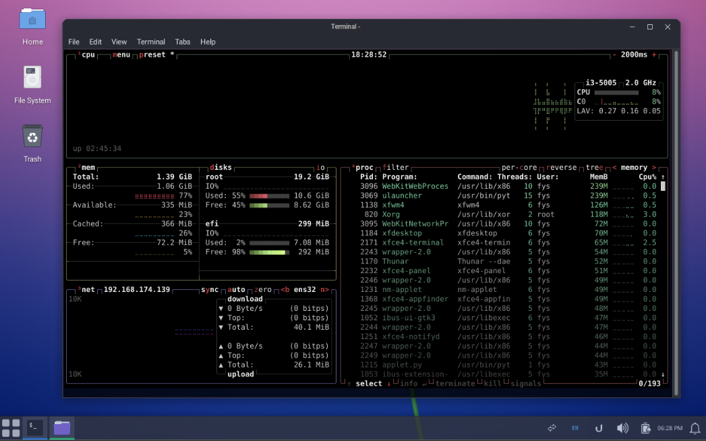

# Tutorial XFCE Theme

https://www.youtube.com/watch?v=gxd2BvUFRJA

# Installation

For Debian

```sh
curl -fsSL https://raw.githubusercontent.com/fiyosa/xfce-theme/master/install_debian.sh | bash
```

# Screenshots







# Manual GUI Setup

## Apply Theme and Icon

- Settings > Appearance > Style > Qogir-Round-Dark
- Settings > Appearance > Icons > Qogir-Dark
- Settings > Appearance > Fonts > Default Font > Roboto Regular (10)
- Settings > Appearance > Fonts > Default Monospace Font > MesloLGS NF Regular (10)
- Settings > Window Manager > Style > Theme > Qogir-Round-Dark
- Settings > Window Manager > Title Font > Roboto Bold
- Settings > Window Manager > Title Alignment > Center
- Settings > Window Manager > Button Layout > "Title" - "Min" - "Max" - "Close"
- Settings > Mouse and Touchpad > Theme > Qogir-Dark

## Set Wallpaper

- Settings > Desktop > Background > Folder > Other > select `~/.local/share/wallpaper` > Open > select image

## Import Panel Profile

- Settings > Panel Profiles > Import (↑ icon) > select file `~/TEMP_THEME/xfce-theme/xfce/xfce4-panel-conf.tar.bz2` > Open > rename file to `xfce4-new-style` > Apply (⚙ icon) > Apply Configuration (disable "Make a backup...")

## Set Start Menu Icon

- Right click on Start Menu > Properties > Icon > click icon > Select Icon From (Image Files) > `~/.local/share/start_menu_icons/quad-grid.svg` > OK

## Setup Ulauncher

- Open search menu > open Ulauncher (this creates `~/.config/ulauncher` and the menubar icon)
- left click icon ulauncher (bottom right) > Preferences > PREFERENCES > Color Theme > Goxir Dark
- left click icon ulauncher (bottom right) > Preferences > PREFERENCES > Launch at Login > enable

## Remove Temporary Folder

```sh
rm -rf ~/TEMP_THEME /tmp/ulauncher_5.16.0_all.deb
```
